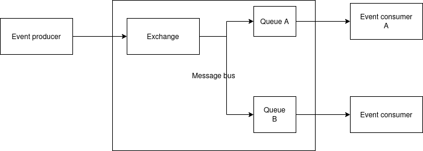

## README

## General note

* Feature to copy document or content have been disabled in Google Docs. It limits ability to format well that document.
* Terraform configuration have well-known simplification due time constrains. Most of them have been marked by `TODO`.

## Question 1

In event processing service we have following components:

* event producer
* message queue / bus eg. Kafka, RabbitMQ
* event consumer

Data loss might happen in each component.

In event consumer the most important is properly manage the acknowledge of the message in the queue. Acknowledge should be performed after success and fully message have been processed. When event consumer components is down during processing, it should be returned automatically to queue when unacknowledged. You have take in consideration timeout and dead queue for failing messages. It's also worth to take into account structure of the processing to achieve idempotency of execution (it's especially important for retries of partially processed messages).

In message queue you should take into account persistency of the queue and acknowledge of successfully write to disk of that message. Persistency and acknowledge usually impact performance highly. It is also important to take into account how persistent storage medium have been used eg. disk replication (asynchronous vs. synchronous) and do not use local ssd (ephemeral one). It is also possible to achieve replication on application level eg. via replication factor of partition in kafka.

In event consumer it highly depends on source of events. The most important is have confirmation of successfully write after message publication.

<!-- Due time constraint I have use draw.io for diagram. I usually use PlantUML for diagram-as-a-code. -->

## Question 2

See all files in that repository.

Following services have been used:

* AWS EC2
    * AWS VPC
    * AWS AMI
    * AWS EBS
* AWS Cloud Map

## Question 3

OLAP database are great database for analytical workloads eg. data warehouse. Query execution might be a few seconds or even a few hours. During query execution a TB of data might be scanned. Data should be loaded in bulk.

Example usage is perform data-based decision by management based eg. transaction performed in few years. Example dataset includes all orders from whole in a nationwide chain of hypermarkets (usually excluding the most recent data eg. a last few hours. Example service is Google Cloud Big Query, AWS RedShift, Snowflake.

OLTP database are great for high volume online transaction including current data eg. online shopping card or fresh orders at e-commerce shop, actual stock at local warehouse, current user profiles at IAM. Example implementation MySQL, PostgreSQL. Example service AWS RDS.
