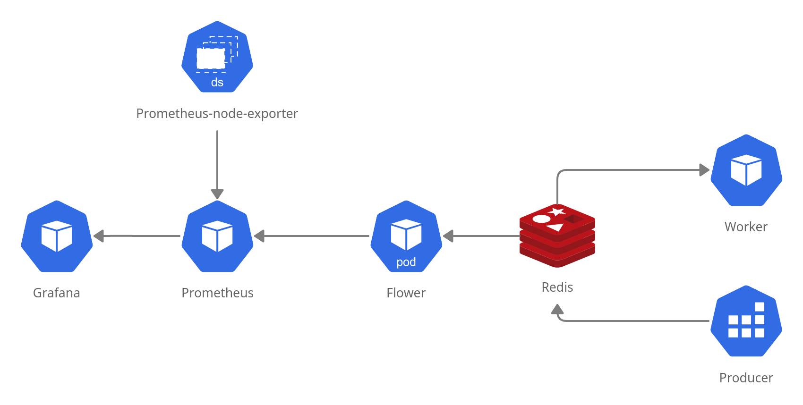

# Helm Chart


## Requirements

* Kubernetes
* kubectl configured with context on online cluster eg. kind
* helm

## Usage

To install use following command:

```bash
helm install --generate-name .
```

Follow notes to access Flower or Grafana.

Data flow in Helm Chart:

